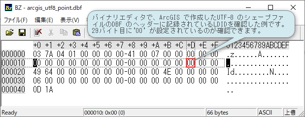
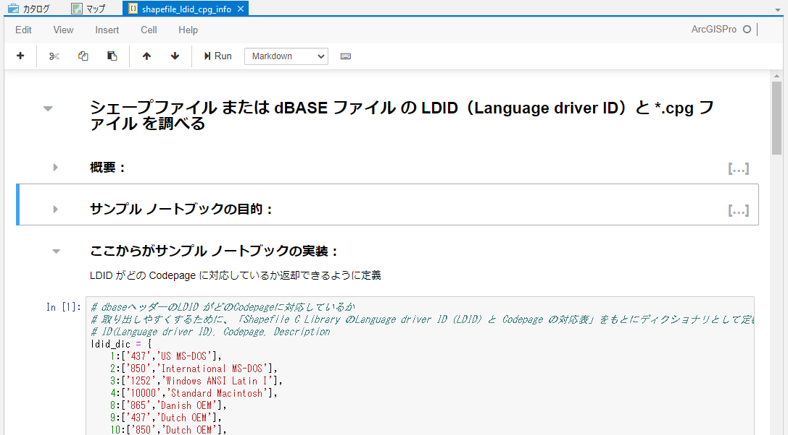

# シェープファイル または dBASE ファイル の LDID（Language driver ID）と *.cpg ファイル を調べる

このページはシェープファイル または dBASE ファイルの LDID（Language driver ID）と、*.cpg ファイルを調査するサンプル ノートブック とそれに関連する技術情報を解説しています。

## 概要

「[操作手順: 各種コード ページでエンコードされたシェープファイルと dBASE ファイルを読み書きする](https://support.esri.com/ja/technical-article/000013192)」  の技術文章で記載しているように、ArcGIS の
dBASE ファイルのコード ページ変換機能 (名称: `dbfDefault`) は、システム レジストリにコード ページ値を指定してアクティブ化するものです。

ESRI ジャパンで提供している、「[シェープファイル文字コード設定ユーティリティ](https://doc.esrij.com/pro/get-started/setup/user/addin_tool/#%E3%82%B7%E3%82%A7%E3%83%BC%E3%83%97%E3%83%95%E3%82%A1%E3%82%A4%E3%83%AB%E6%96%87%E5%AD%97%E3%82%B3%E3%83%BC%E3%83%89%E8%A8%AD%E5%AE%9A%E3%83%A6%E3%83%BC%E3%83%86%E3%82%A3%E3%83%AA%E3%83%86%E3%82%A3)」 は、この `dbfDefault` の設定をユーザーインターフェイス で設定するためのツールです。

また、上記の[操作手順](https://support.esri.com/ja/technical-article/000013192)  には、`dbfDefault` をレジストリに設定することにより出来ることが解説されているほか、dBASE ファイル の LDID（Language driver ID）, *.cpgファイル の有無による、アプリケーションでの挙動について次のように解説されています。

「シェープファイル または dBASE ファイルに LDID や *.cpg ファイルが存在しない場合、ArcGIS は、`dbfDefault` で定義されたコード ページでファイルがエンコードされると見なします。 たとえば、dbfDefault 値が OEM に設定され、dBASE ファイルに LDID および *.cpg ファイルが両方とも存在しない場合、ArcGIS はファイルが OEM でエンコードされると見なすため、ArcMap、ArcCatalog、および ArcGIS Pro で 8 ビット文字を表示するためにコード ページ変換を実行します (これは、どのアプリケーションも、ANSI コード ページを使用して文字列を表示する Windows プログラムであるためです)。」

裏を返せば、国内で一部のシェープファイル で文字化けが発生するのは、

- dBASE ファイルの LDID（Language driver ID）が存在しない（値が00）
- オプションの *.cpg ファイル が提供されていない

の両方があてはまる場合であるとも言えます。

**※** 上記の[操作手順](https://support.esri.com/ja/technical-article/000013192)  は、デスクトップ製品に関する記載となっていますが、ArcGIS Online や ArcGIS Enterprise でも同様の挙動となります。具体的には、シェープファイル の登録時に指定する ZIP ファイル内に格納された dBASE ファイルの LDID と *.cpg ファイル の両方が存在しない場合、公開後の[フィーチャ レイヤー](https://doc.arcgis.com/ja/arcgis-online/reference/feature-layers.htm) が文字化けした状態になります。

## dbase ファイル の LDID（Language driver ID）の仕様

dBASE ファイル の LDID（Language driver ID） は、dBase ファイルの ヘッダーセクション に記録されます。実際のバイナリ仕様は、「[Data File Header Structure for the dBASE Version 7 Table File](https://www.dbase.com/Knowledgebase/INT/db7_file_fmt.htm)」 等で確認することが可能で、それによると、LDID（Language driver ID） は次のように29バイト目から、1バイトで記録されることになっています。

Byte|Contents|Description|
:---|:---|:---|
29|1 byte|Language driver ID(LDID).|

### ArcGIS で作成した シェープファイル の仕様
一方、LDID（Language driver ID） の値としてどのような値が記録されているのかを、ArcGIS で作成したシェープファイルを例にして見てみます。
- ArcGIS で作成したShift-JIS のシェープファイル の場合：
 dBASE ファイル の LDID（Language driver ID）をバイナリエディターを使って確認してみると、Shift-JIS のシェープファイルの場合、次図のようにdBASE ファイル の LDID（Language driver ID） は`13` に設定されています。*.cpg ファイルは作成されません。

  
  

- ArcGIS で作成したUTF-8 のシェープファイルの場合：
 dBASE ファイル の LDID（Language driver ID） は`00` が設定されています。また、*.cpg ファイルが作成され、そのファイルの中に`UTF-8` と記録されています。

  
  

確かに「[シェープファイルの文字コードに関する注意](https://esrij-esri-support.custhelp.com/app/answers/detail/a_id/5411/session/L2F2LzEvdGltZS8xNjQ5OTA3MDM4L2dlbi8xNjQ5OTA3MDM4L3NpZC9mVTVUeVdEMVZBWUg3dFNWV2VZNU9ad3BTN05DOVZxcUMyZ1hGaFlnZktMcG1FMzZpZ192MyU3RUdUbDNDUFd0QXVhWnJ6RjBkcGREamlNeW9OQVhFbXRpbmJNVWJsQ3NpVGZIcDBtZGUweTJWRjZQdmpkR21PeDQyQSUyMSUyMQ%3D%3D)」 の 既存のシェープファイルの文字コードを確認する方法 に記載がある状態になっているようです。
  
  
**※** LDID（Language driver ID）と Codepage の値の対応は、[Shapefile C Library のcodepage.html](http://shapelib.maptools.org/codepage.html) にまとまっています。

## サンプル ノートブック と サンプル Python ツールボックス

シェープファイル または dBase ファイル の LDID（Language driver ID）と*.cpg ファイル を一覧表示する処理と、*.cpg ファイルを一括で作成するノートブックと[Python ツールボックス](https://pro.arcgis.com/ja/pro-app/latest/arcpy/geoprocessing_and_python/a-quick-tour-of-python-toolboxes.htm) を公開しています。  
ファイル一式は、[こちらから](https://github.com/EsriJapan/shapefile_info/archive/refs/heads/main.zip) 入手可能です。
**※** 動作環境としては Python 3.x 系を対象としております。Python 2.x 系では動作しませんのでご注意ください。

- ノートブック: [shapefile_ldid_cpg_info.ipynb](https://github.com/EsriJapan/shapefile_info/blob/main/shapefile_ldid_cpg_info.ipynb )
  
  
- Python ツールボックス: [Shapefile_info_toolbox.pyt](https://github.com/EsriJapan/shapefile_info/blob/main/Shapefile_info_toolbox.pyt )
  

なお、*.cpg ファイル の手動での作成方法は、[問題：シェープファイルや DBF ファイルが文字化けする](https://esrij-esri-support.custhelp.com/app/answers/detail/a_id/5850)  に記載がありますので、そちらをご参照ください。  

また、LDID（Language driver ID）は『 [シェープファイルの技術情報](http://www.esrij.com/cgi-bin/wp/wp-content/uploads/documents/shapefile_j.pdf) 』の中では、「言語ドライバ ID」として記載されているものです。
  

## 参考情報

本サンプル ノートブック や Python ツールボックス を作成するために参考にさせていただいた種々の情報です。

* Python - read shapefile .dbf for encoding（2.x 系）；  
  https://gis.stackexchange.com/questions/52623/python-read-shapefile-dbf-for-encoding
  
  
* Data File Header Structure for the dBASE Version 7 Table File；   
  https://www.dbase.com/Knowledgebase/INT/db7_file_fmt.htm
  
  
* Shapefile C Library のLanguage driver ID（LDID）と Codepage の対応表；   
  http://shapelib.maptools.org/codepage.html
  
  
* PythonでバイナリをあつかうためのTips；  
  https://qiita.com/pashango2/items/5075cb2d9248c7d3b5d4
  
  
* ディレクトリ内のファイルを操作するさまざまな方法の例；   
  https://realpython.com/working-with-files-in-python/
  
* ArcPy 学習用資料；   
  https://github.com/EsriJapan/arcpy-resources

* A quick tour of creating tools with Python；   
  https://pro.arcgis.com/ja/pro-app/latest/arcpy/geoprocessing_and_python/a-quick-tour-of-creating-tools-in-python.htm

## 免責事項
* 本リポジトリに含まれるノートブック ファイルはサンプルとして提供しているものであり、動作に関する保証、および製品ライフサイクルに従った Esri 製品サポート サービスは提供しておりません。
* 本ツールに含まれるツールによって生じた損失及び損害等について、一切の責任を負いかねますのでご了承ください。
* 弊社で提供しているEsri 製品サポートサービスでは、本ツールに関しての Ｑ＆Ａ サポートの受付を行っておりませんので、予めご了承の上、ご利用ください。詳細は[
ESRIジャパン GitHub アカウントにおけるオープンソースへの貢献について](https://github.com/EsriJapan/contributing)をご参照ください。

## ライセンス
Copyright 2022 Esri Japan Corporation.

Apache License Version 2.0（「本ライセンス」）に基づいてライセンスされます。あなたがこのファイルを使用するためには、本ライセンスに従わなければなりません。
本ライセンスのコピーは下記の場所から入手できます。

> http://www.apache.org/licenses/LICENSE-2.0

適用される法律または書面での同意によって命じられない限り、本ライセンスに基づいて頒布されるソフトウェアは、明示黙示を問わず、いかなる保証も条件もなしに「現状のまま」頒布されます。本ライセンスでの権利と制限を規定した文言については、本ライセンスを参照してください。

ライセンスのコピーは本リポジトリの[ライセンス ファイル](./LICENSE)で利用可能です。